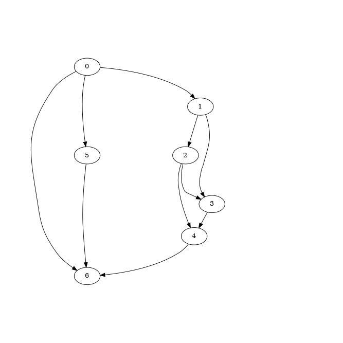
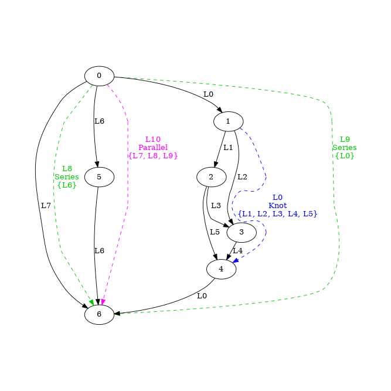
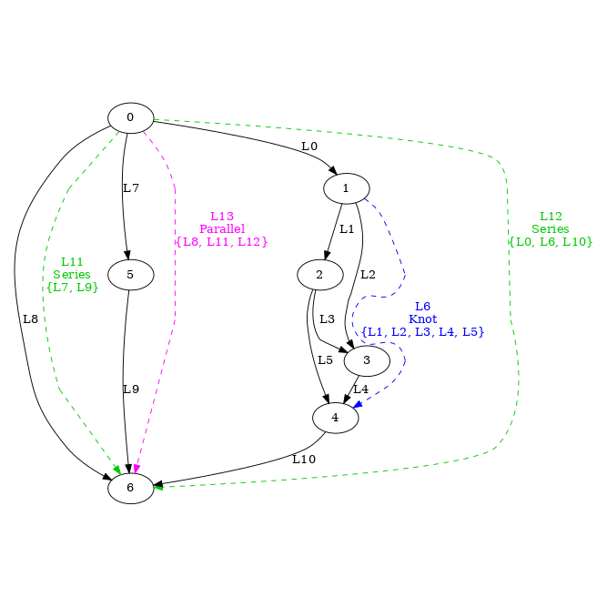
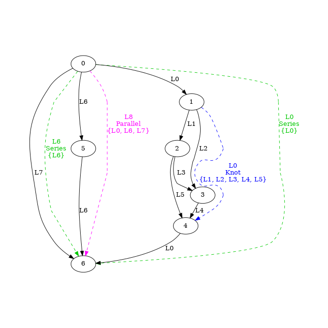
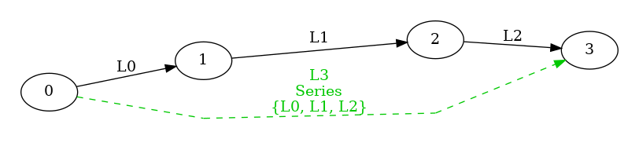
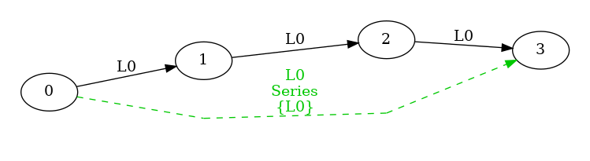
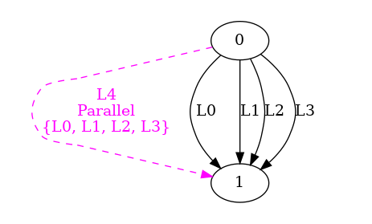
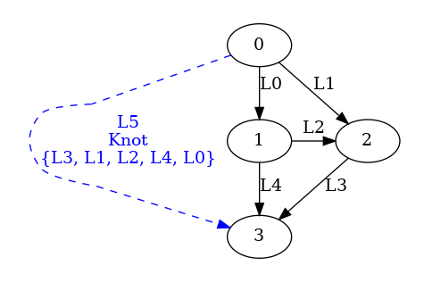
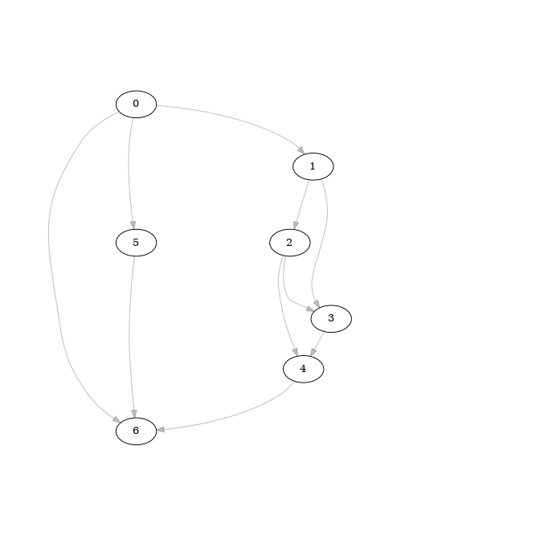

# Monbetsu

Monbetsu is a classifier for edges/subgraphs in a DAG.
It makes hierarchical groups so that thier components (edge or subgraph) are connected with no branchs,
and labels them respectively.
The components of each groups share the same label.

For example, Monbetsu labels the edges/subgraphs in the below DAG  
  
as the following:  


Also, below variations of classification are available:

- *Unique*  
  
- *Integrated*  
  

The targets of labeling are as follows:

- Edge: each edges of the graph.

- Subgraphs: they have single start node, single end node, and multiple labeled components (edges/sub-subgraphs).
  
  - *Series*: their components are connected sequentially. They are greedly grouped so that any of the components are not *Series*.  
    *Series* has following variations:
    
    - *Default*: the subgraph has a label, and its components share another label.  
      
    - *Unique*: the subgraph and its components have unique labels respectively.  
      
    - *Integrated*: the subgraph and its components share a label.  
      
  
  - *Parallel*: the labels of their components share a pair of start/end node. They are greedly grouped so that any of the componsents are not *Parallel*.  
    
  
  - *Knot*: otherwise.  
    
  
  The other kinds of subgraph which have multiple start/end nodes are not labeled.

The labeling is hierarchical and bottom-up (i.e. edges -> smaller subgraphs -> larger subgraphs).  
The order of labeling edges is not defined in the current implementation.  
The following animation illustrates the steps of labeling.  


## Installation

Copy [MonbetsuClassifier.cs](Monbetsu/MonbetsuClassifier.cs) to your project. (Monbetsu is not in NuGet.)

#### Prerequisites

- C# 8.0 or above
- one of the following
  - .NET Standard  2.0 or above
  - .NET Core 2.0 or above
  - .NET Framework 4.7.1 or above

If your project uses the older version, some modifications (e.g. adding reference to System.ValueTuple) would be required.

## Usage

Call one of `Classify` methods declared in class `MonbetsuClassifier`, `MonbetsuClassifier.Uniquly`, or `MonbetsuClassifier.Integratedly`.
Also, `Classify`, `ClassifyUniquely`, or `ClassifyIntegratedly` methods declared in class ``MonbetsuClassifier`3``, or ``MonbetsuClassifier`4`` are able to call.  
All of them call one common logic internally.  
They have type parameters, `TGraph`(Optional), `TNode`, `TEdge`, and `TLabel` which represent types of graph, node, edge, and label respectively.  
thier overloads consist of parameters for the start nodes of a DAG, combinations of:

- with or without `TGraph` object,
- interface-based or delegate-based callbacks,

and an optional `CancellationToken` object.

When the name of the method or the class contains **Uniquely**, *Series* subgraphs are *Unique*.  
Similarly, when one contains **Integratedly**, *Series* subgraphs are *Integrated*.

#### Tutorial 1

```csharp
namespace Monbetsu.Tutorials.Tutorial1
{
    using Monbetsu;

    class Node
    {
        public int Id { get; set; }
        public List<Edge> Ins { get; set; } = new List<Edge>();
        public List<Edge> Outs { get; set; } = new List<Edge>();

        public override string ToString() => $"{Id}";
    }

    class Edge
    {
        public Node FromNode { get; }
        public Node ToNode { get; }

        public Edge(Node fromNode, Node toNode)
        {
            FromNode = fromNode ?? throw new ArgumentNullException(nameof(fromNode));
            ToNode = toNode ?? throw new ArgumentNullException(nameof(toNode));
        }

        public override string ToString() => $"({FromNode}, {ToNode})";
    }

    class Label
    {
        public string Name { get; }

        public Label(string name)
        {
            Name = name ?? throw new ArgumentNullException(nameof(name));
        }

        public override string ToString() => Name;
    }

    class GraphEnv
    {
        private static Label CreateLabelFromEdge(Node fromNode, Edge edge, Node toNode)
            => new Label($"Label:{fromNode}-{edge}->{toNode}");

        private static Label CreateLabelFromSubgraph(Node startNode, Node endNode)
            => new Label($"Label:{startNode}-..->{endNode}");

        private static IEnumerable<(Edge edge, Node toNode)> GetOutflows(Node fromNode)
            => fromNode.Outs.Select(e => (e, e.ToNode));

        
        private List<Node> SetUpDAG()
        {
            var nodes = Enumerable.Range(0, 7).Select(n => new Node { Id = n }).ToList();
            var edges = new[]
            {
                (from: 0, to: 1),
                (from: 1, to: 2),
                (from: 1, to: 3),
                (from: 2, to: 3),
                (from: 2, to: 4),
                (from: 3, to: 4),
                (from: 4, to: 6),
                (from: 0, to: 5),
                (from: 5, to: 6),
                (from: 0, to: 6)
            }.Select(e => new Edge(nodes[e.from], nodes[e.to])).ToList();

            foreach (var n in nodes)
            {
                n.Ins = edges.Where(e => e.ToNode == n).ToList();
                n.Outs = edges.Where(e => e.FromNode == n).ToList();
            }
            return nodes;
        }

        public void RunDelegateBased()
        {
            var nodes = SetUpDAG();
            MonbetsuClassifier.Classify<Node, Edge, Label>(
                // start nodes of the DAG
                new[] { nodes[0] }, 
                // callback to get forward edges and to-nodes of a from-node.
                GetOutflows,
                // callback to create a label object from a edge.
                CreateLabelFromEdge,
                // callback to create a label object from a subgraph.
                CreateLabelFromSubgraph,
                (Node fromNode, Edge edge, Node toNode, Label label) =>
                {
                    // This callback is called for each edges labeling.
                    Debug.WriteLine($"{edge} is labeled as {label}.");
                },
                (Node startNode, Label sublabel, Node endNode, Label label) =>
                {
                    // This callback is called for each Serieses labeling.
                    Debug.WriteLine($"series subgraph ({startNode} -..-> {endNode}) is labeled as {label}.");
                    Debug.WriteLine($"  sublabel: {sublabel}");
                },
                (Node startNode, IEnumerable<Label> sublabels, Node endNode, Label label) =>
                {
                    // This callback is called for each Parallels labeling.
                    Debug.WriteLine($"parallel subgraph ({startNode} -..-> {endNode}) is labeled as {label}.");
                    Debug.WriteLine($"  sublabels: {string.Join(", ", sublabels)}");
                },
                (Node startNode, IEnumerable<Label> sublabels, Node endNode, Label label) =>
                {
                    // This callback is called for each Knots labeling.
                    Debug.WriteLine($"knot subgraph ({startNode} -..-> {endNode}) is labeled as {label}.");
                    Debug.WriteLine($"  sublabels: {string.Join(", ", sublabels)}");
                });
        }

        public void RunInterfaceBasedWithCyclicCheck()
        {
            var nodes = SetUpDAG();

            // Interfaces have methods correspond to delegates for delegate-based one, and grouped by the kind of them. 
            var structure = new GraphStructure();
            var factory = new LabelFactory();
            var labeler = new Labeler();

            try
            {
                MonbetsuClassifier.Classify(new[] { nodes[0] },
                    structure,
                    factory,
                    labeler);
            }
            catch(CyclicException<Node, Edge> exception)
            {
                // When the input graph have cycle, this exception is thrown.
                Debug.WriteLine(exception);
            }

            foreach(var record in labeler.Records)
            {
                Debug.WriteLine(record);
            }
        }

        public void RunInterfaceBasedAsOtherVariations()
        {
            var nodes = SetUpDAG();

            var structure = new GraphStructure();
            var factory = new LabelFactory();
            var labeler = new Labeler();

            MonbetsuClassifier.Integratedly.Classify(new[] { nodes[0] },
                structure,
                factory,
                labeler);

            Debug.WriteLine("result of Integrated ");
            foreach (var record in labeler.Records)
            {
                Debug.WriteLine(record);
            }

            labeler.Records.Clear();

            MonbetsuClassifier.Uniquely.Classify(new[] { nodes[0] },
                structure,
                factory,
                labeler);

            Debug.WriteLine("result of Unique");
            foreach (var record in labeler.Records)
            {
                Debug.WriteLine(record);
            }
        }

        class GraphStructure : IGraphStructure<Node, Edge>
        {
            public IEnumerable<(Edge, Node)> GetOutflows(Node node) => GraphEnv.GetOutflows(node);
        }

        class LabelFactory : ILabelFactory<Node, Edge, Label>
        {
            private int idSeq = 0;

            public Label CreateFromEdge(Node fromNode, Edge edge, Node toNode) => CreateFromSubgraph(fromNode, toNode);
            public Label CreateFromSubgraph(Node startNode, Node endNode) => new Label($"Label:{idSeq++}");
        }

        class Labeler : ILabeler<Node, Edge, Label>, IUniquelyLabeler<Node, Edge, Label>
        {
            public List<(Node from, Node to, Label label, string kind, string subs)> Records { get; } = new List<(Node from, Node to, Label label, string kind, string subs)>();

            private void Record(Node from, Node to, Label label, string kind, string subs) => Records.Add((from, to, label, kind, subs));
            public void LabelEdge(Node fromNode, Edge edge, Node toNode, Label label) => Record(fromNode, toNode, label, "edge", edge.ToString());
            public void LabelKnotSubgraph(Node startNode, IEnumerable<Label> sublebels, Node endNode, Label label) => Record(startNode, endNode, label, "knot", string.Join(", ", sublebels));
            public void LabelParallelSubgraph(Node startNode, IEnumerable<Label> sublebels, Node endNode, Label label) => Record(startNode, endNode, label, "parallel", string.Join(", ", sublebels));

            // called only when variation of Series is Default or Integrated.
            public void LabelSeriesSubgraph(Node startNode, Label sublebel, Node endNode, Label label) => Record(startNode, endNode, label, "series", sublebel.ToString());


            // called only when variation of Series is Unique.
            public void LabelSeriesSubgraph(Node startNode, IEnumerable<Label> sublebels, Node endNode, Label label) => Record(startNode, endNode, label, "series", string.Join(", ", sublebels));
        }
    }
}

```

#### Tutorial 2

```csharp
namespace Monbetsu.Tutorials.Tutorial2
{
    using Monbetsu;

    class Graph
    {
        public List<(int from, int to)> Edges { get; set; } = new List<(int from, int to)>();
    
        public IEnumerable<((int from, int to) edge, int toNode)> GetOutflows(int fromNode)
            => Edges.Where(edge => edge.from == fromNode).Select(edge => (edge, edge.to));
    }

    class GraphEnv
    {
        private Graph SetUpDAG()
        {
            var graph = new Graph();
            graph.Edges.AddRange(new[]
            {
                (from: 0, to: 1),
                (from: 1, to: 2),
                (from: 1, to: 3),
                (from: 2, to: 3),
                (from: 2, to: 4),
                (from: 3, to: 4),
                (from: 4, to: 6),
                (from: 0, to: 5),
                (from: 5, to: 6),
                (from: 0, to: 6)
            });
            return graph;
        }

        public void RunWithGraphArgument()
        {
            var graph = SetUpDAG();
            MonbetsuClassifier.Classify<Graph, int, (int from, int to), string>(
                // a DAG
                graph,
                // start nodes of the DAG
                new[] { 0 },
                // callback to get forward edges and to-nodes of a from-node.
                (g, n) => g.GetOutflows(n),
                // callback to create a label object from a edge.
                (Graph graph, int fromNode, (int from, int to) edge, int toNode) => $"Label:{edge}",
                // callback to create a label object from a subgraph.
                (Graph graph, int startNode, int endNode) => $"Label:{startNode}-..->{endNode}",
                (Graph graph, int from, (int from, int to) edge, int to, string label) =>
                {
                    // This callback is called for each edge labeling.
                    Debug.WriteLine($"{edge} is labeled as {label}.");
                },
                (Graph graph, int startNode, string sublabel, int endNode, string label) =>
                {
                    // This callback is called for each series labeling.
                    Debug.WriteLine($"series subgraph ({startNode} -..-> {endNode}) is labeled as {label}.");
                    Debug.WriteLine($"  sublabel: {sublabel}");
                },
                (Graph graph, int startNode, IEnumerable<string> sublabels, int endNode, string label) =>
                {
                    // This callback is called for each parallel labeling.
                    Debug.WriteLine($"parallel subgraph ({startNode} -..-> {endNode}) is labeled as {label}.");
                    Debug.WriteLine($"  sublabels: {string.Join(", ", sublabels)}");
                },
                (Graph graph, int startNode, IEnumerable<string> sublabels, int endNode, string label) =>
                {
                    // This callback is called for each knot labeling.
                    Debug.WriteLine($"knot subgraph ({startNode} -..-> {endNode}) is labeled as {label}.");
                    Debug.WriteLine($"  sublabels: {string.Join(", ", sublabels)}");
                });
        }

        public void RunWithGraphArgumentAsUnique()
        {
            var graph = SetUpDAG();
            MonbetsuClassifier.Uniquely.Classify<Graph, int, (int from, int to), string>(graph,
                new[] { 0 },
                (g, n) => g.GetOutflows(n),
                (Graph graph, int fromNode, (int from, int to) edge, int toNode) => $"Label:{edge}",
                (Graph graph, int startNode, int endNode) => $"Label:{startNode}-..->{endNode}",
                (Graph graph, int from, (int from, int to) edge, int to, string label) =>
                {
                    Debug.WriteLine($"{edge} is labeled as {label}.");
                },
                (Graph graph, int startNode, IEnumerable<string> sublabels, int endNode, string label) =>
                {
                    Debug.WriteLine($"series subgraph ({startNode} -..-> {endNode}) is labeled as {label}.");
                    Debug.WriteLine($"  sublabels: {string.Join(", ", sublabels)}");
                },
                (Graph graph, int startNode, IEnumerable<string> sublabels, int endNode, string label) =>
                {
                    Debug.WriteLine($"parallel subgraph ({startNode} -..-> {endNode}) is labeled as {label}.");
                    Debug.WriteLine($"  sublabels: {string.Join(", ", sublabels)}");
                },
                (Graph graph, int startNode, IEnumerable<string> sublabels, int endNode, string label) =>
                {
                    Debug.WriteLine($"knot subgraph ({startNode} -..-> {endNode}) is labeled as {label}.");
                    Debug.WriteLine($"  sublabels: {string.Join(", ", sublabels)}");
                });
        }

        public void RunWithGraphArgumentAsIntegrated()
        {
            var graph = SetUpDAG();
            MonbetsuClassifier.Integratedly.Classify<Graph, int, (int from, int to), string>(graph,
                new[] { 0 },
                (g, n) => g.GetOutflows(n),
                (Graph graph, int fromNode, (int from, int to) edge, int toNode) => $"Label:{edge}",
                (Graph graph, int startNode, int endNode) => $"Label:{startNode}-..->{endNode}",
                (Graph graph, int from, (int from, int to) edge, int to, string label) =>
                {
                    Debug.WriteLine($"{edge} is labeled as {label}.");
                },
                (Graph graph, int startNode, string sublabel, int endNode, string label) =>
                {
                    Debug.WriteLine($"series subgraph ({startNode} -..-> {endNode}) is labeled as {label}.");
                    Debug.WriteLine($"  sublabel: {sublabel}");
                },
                (Graph graph, int startNode, IEnumerable<string> sublabels, int endNode, string label) =>
                {
                    Debug.WriteLine($"parallel subgraph ({startNode} -..-> {endNode}) is labeled as {label}.");
                    Debug.WriteLine($"  sublabels: {string.Join(", ", sublabels)}");
                },
                (Graph graph, int startNode, IEnumerable<string> sublabels, int endNode, string label) =>
                {
                    Debug.WriteLine($"knot subgraph ({startNode} -..-> {endNode}) is labeled as {label}.");
                    Debug.WriteLine($"  sublabels: {string.Join(", ", sublabels)}");
                });
        }
    }
}
```

## Demo

Online demo page implemented by Blazor is [here](https://takeisit.github.io/Monbetsu/).