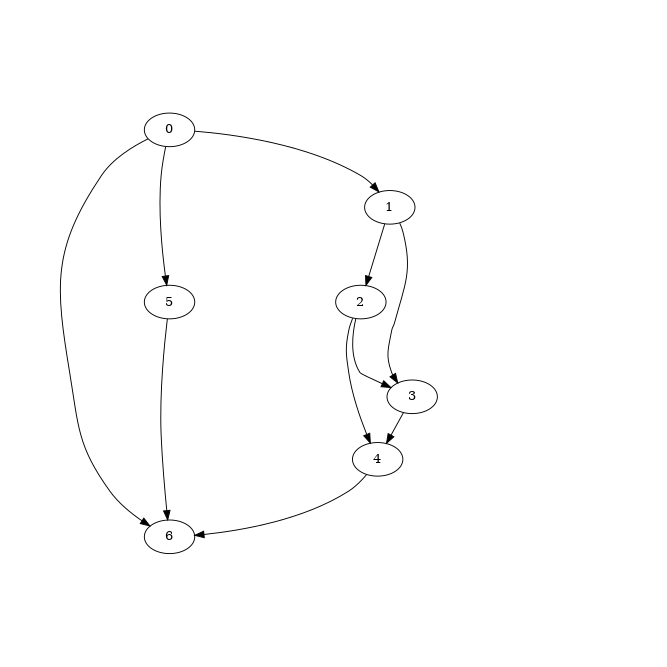
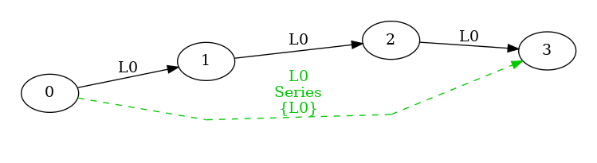
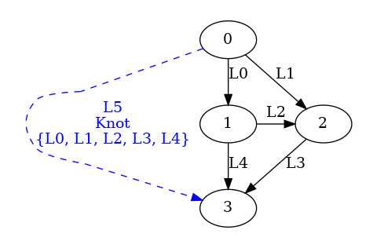

# Monbetsu #
Monbetsu is a classifier for edges/subgraphs in a DAG.
It makes hierarchical groups so that thier components (edge or subgraph) are connected with no branchs,
and labels them respectively.
The components of each groups share the same label.

For example, Monbetsu labels the edges/subgraphs in the below DAG  
   
as the following:  
   

Also, below variations of classification are available:  
- *Unique*  
     
- *Integrated*  
    


The targets of labeling are as follows:

- Edge: each edges of the graph.
- Subgraphs: they have single start node, single end node, and multiple labeled components (edges/sub-subgraphs).
  - *Series*: their components are connected sequentially. They are greedly grouped so that any of the components are not *Series*.  
    *Series* has following variations:
    - *Default*: the subgraph has a label, and its components share another label.  
         
    - *Unique*: the subgraph and its components have unique labels respectively.  
         
    - *Integrated*: the subgraph and its components share a label.  
         

  - *Parallel*: the labels of their components share a pair of start/end node. They are greedly grouped so that any of the componsents are not *Parallel*.  
       
  - *Knot*: otherwise.  
       

  The other kinds of subgraph which have multiple start/end nodes are not labeled.

The labeling is hierarchical and bottom-up (i.e. edges -> smaller subgraphs -> larger subgraphs).  
The order of labeling edges is not defined in the current implementation.  
The following animation illustrates the steps of labeling.  
   


## Installation ##
Copy [MonbetsuClassifier.cs](../Monbetsu/MonbetsuClassifier.cs) to your project. (Monbetsu is not in NuGet.)

#### Prerequisites ####
- C# 8.0 or above
- one of the following
  - .NET Standard  2.0 or above
  - .NET Core 2.0 or above
  - .NET Framework 4.7.1 or above
  
If your project uses the older version, some modifications (e.g. adding reference to System.ValueTuple) would be required.

## Usage ##

Call one of ``Classify`` methods declared in class ``MonbetsuClassifier``, ``MonbetsuClassifier.Uniquly``, or ``MonbetsuClassifier.Integratedly``.
Also, ``Classify``, ``ClassifyUniquely``, or ``ClassifyIntegratedly`` methods declared in class ``MonbetsuClassifier`3``, or ``MonbetsuClassifier`4`` are able to call.  
All of them call one common logic internally.  
They have type parameters, ``TGraph``(Optional), ``TNode``, ``TEdge``, and ``TLabel`` which represent types of graph, node, edge, and label respectively.   
thier overloads consist of parameters for the start nodes of a DAG, combinations of:
- with or without ``TGraph`` object,
- interface-based or delegate-based callbacks,  

and an optional ``CancellationToken`` object.  

When the name of the method or the class contains **Uniquely**, *Series* subgraphs are *Unique*.  
Similarly, when one contains **Integratedly**, *Series* subgraphs are *Integrated*.  


#### Tutorial 1 ####
```csharp ../Monbetsu.Test/Tutorials.cs
namespace Monbetsu.Tutorials.Tutorial1
{
}
```

#### Tutorial 2 ####
```csharp ../Monbetsu.Test/Tutorials.cs
namespace Monbetsu.Tutorials.Tutorial2
{
}

```

## Demo ##
Online demo page implemented by Blazor is [here](https://takeisit.github.io/Monbetsu/).
